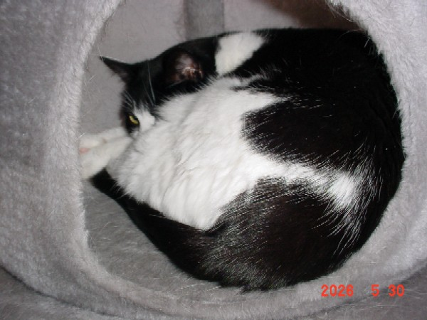
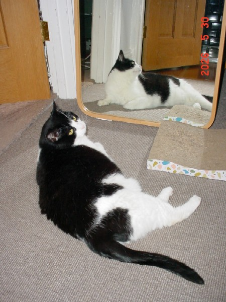
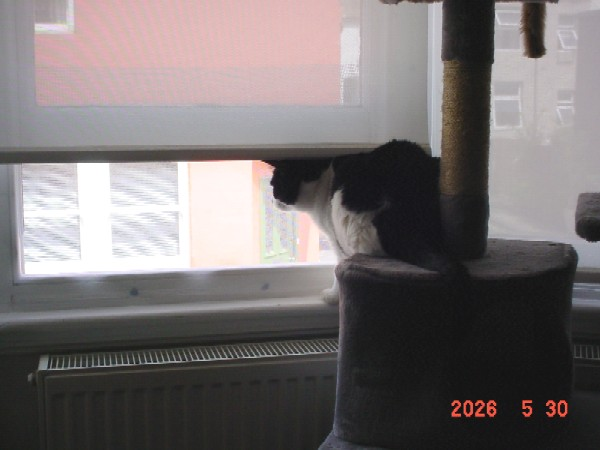
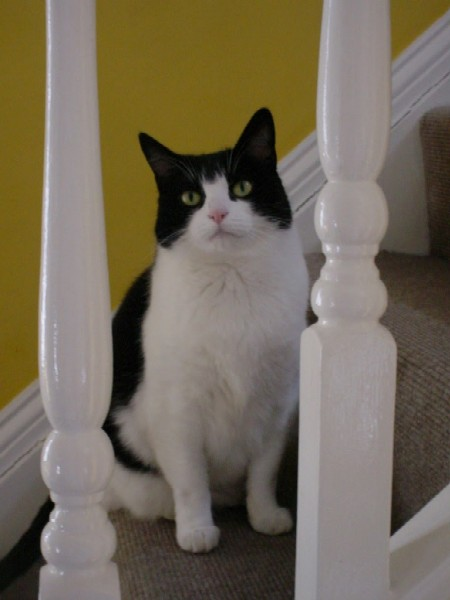

# Oreo the Cat

Oreo is our tuxedo cat. She is about 6 years old and very shy around strangers. When we first got her she wouldn't come out from under the bed. But over the years she has come to trust us and become very brave, even if she still won't let us pick her up!

## Oreo Facts

- She's a rescue.
  - We got her from The Cats Whiskers Rescue in Hertfordshire in May 2022.
  - She was found on the streets of Stevenage.
- We don't know exactly when she was born, but it was most likely in early 2020.
- She doesn't like wet food or fish.
- The vet says she's fat, but she's just a big cat >:(

