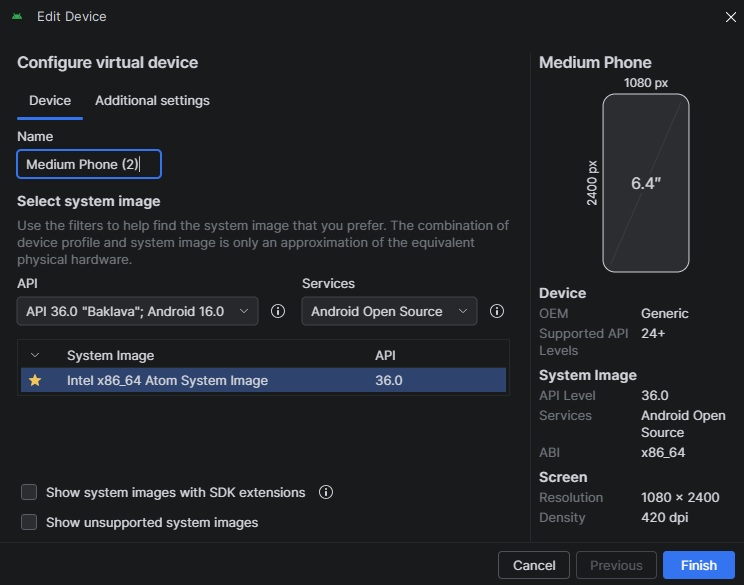

# Map Downloader

I'm a big fan of maps, and in preparation for some walks in the Sussex countryside I bought some OS Explorer maps for the local area.

In this modern day and age of the Information Superhighway each paper map comes with a code that can be used to redeem access to that map in the OS Maps app. Having access to the maps in the app is nice, but I really wanted to have them available as image files for printing and offline access.

## First Attempt

Some quick online searching turned up a Python script by [Ari Cooper Davis](https://github.com/aricooperdavis/OS-Maps-app-tools) called [OS-Maps-app-tool](https://github.com/aricooperdavis/OS-Maps-app-tools). His tool requires a rooted android phone or an emulated android phone using the Android Studio SDK. As I don't have a rooted phone, I decided to try and get an Android virtual machine set up.

### Android Studio



Because we need to be able to access the contents of an installed app, care must be taken to chose a system image that will let us connect to it with the Android Debug Bridge (ADB) as root.

This system image doesn't come with the Play Store so apps have to be sought elsewhere. I think my attempts to download an APK of the OS Maps app myself failed as this emulated phone is using an x86\_64 CPU rather than a phone's usual ARM chip.

After a bunch of failed attempts to get the app installed, I found [APKUpdater](http://github.com/rumboalla/apkupdater). It searches a whole range of app sources for a version of the app compatible with your device. With the OS Maps app installed (version 5.5.5.1445) I was able to log in and download my purchased maps to the fake phone.

### Ari's Script

The OS-Maps-app-tool README includes helpful instructions on how to locate the required files from the app's directory and copy them to an accessible location on the phone. Comparing the file locations expected by the supplied commands to the folder structure of my version of the app there seemed to be a discrepancy.

In the end I was able to locate the map\_data.db and customOfflineMaps.db files, and with ADB, pull them directly from the phone to my laptop. Running the extract command, however, resulted in an MBTiles file with a bunch of empty tiles.

The database files turned out to be SQLite, so I opened them up in [SQLite Viewer](https://sqliteviewer.app/) to see what was in there.

#### customOfflineMaps.db

(infodb)

- id _- integer_
- correlated\_id _- integer_
- server\_id _- text_
- deleted _- integer_
- map\_name _- text_
- pixel\_ratio _- real_
- tile\_version _- text_
- route\_server _- text_
- route\_local\_id _\- integer_
- style\_url _- text_
- layer\_type _- text_
- latitude\_north _- real_
- latitude\_south _- real_
- longitude\_east _- real_
- longitude\_west _- real_
- zoom\_min _- real_
- zoom\_max _- real_
- product\_id _- text_
- map\_series _- text_
- status _- text_
- progress _- real_
- current\_size _- real_
- total\_size _- real_
- error _- text_

#### map\_data.db

(tiledb)

- id _- integer_
- url\_template _- text_
- pixel\_ratio _- integer_
- z _- integer_
- x _- integer_
- y _- integer_
- expires _- integer_
- modified _- integer_
- etag _- text_
- data _- blob_
- compressed _- integer_
- accessed _- integer_
- must\_revalidate _- integer_

While customOfflineMaps.db had a lot more columns, it just listed the maps I had purchased. map\_data.db had a data field which OS-Maps-app-tool merges along with the z, x, and y fields into an MBTiles file, but for some reason the data field no longer holds the image data.

Poking around the OS Maps app data using the ADB shell found me a couple of very useful things: a "tiles" folder and a "sources" folder. Tiles contains all the images for the tiles as PNG files, organised by {z}/{x}/{y}.png. Sources contains JSON files for each map sheet with the URL the tiles can be downloaded from and the min and max values for z:

```json
  {
    "a": "https://tiles.leisure.maps.osinfra.net/2020-06/1\_25k/{z}/{x}/{y}.png", // URL
    "b": 256,
    "c": 12, // min z
    "d": 16, // max z
    "e": {
        "a": 51.15052918335848, // north edge
        "b": 50.9647583113048, // south edge
        "c": -0.14290444314129358, // east edge
        "d": -0.577139454641428 // west edge
        }
    }
```

With this information I don't even need the two database files and I can just use this information to stitch the images in the tiles folder together (or even download them without having to set up an Android VM at all!)

## Second Attempt

The JSON files tell me where to get the tiles, and the area the map covers, but the map bounds are in degrees and the map server is expecting X and Y to be tile numbers.

### Map Tiles

Latitude and longitude can be converted to tile numbers with some quick maths in Python like so:

```python
def lat\_lon\_to\_tile(lat, lon, zoom):
  n = 2 \*\* zoom
  x = math.floor((lon + 180) / 360 \* n)
  y = (math.floor((1 - math.log(math.tan(math.radians(lat))
    + 1 / math.cos(math.radians(lat))) / math.pi) / 2 \* n))
  return x, y
```

Using the coordinates in the JSON file we can work out the north-west and south-east most tiles for our required zoom level and loop through the grid of tiles in between. I already have the tiles downloaded from the app in the "tiles.leisure.maps.osinfra.net/2020-06/1\_25k/{z}/{x}/{y}.png" folder structure, so I rewrote the script to stitch the tiles for each map into one big image.

The Python library Pillow was used to create a canvas with the width and height in tiles times 256px before pasting the tiles into their relevant positions and creating a new PNG file. Being PNGs, the file sizes were huge, but I can always convert them to JPEGs in Photoshop.

### Trying the API

Now I knew where the OS Maps app was getting the tile images from, and that it wasn't using any sort of encryption or authentication, I starting poking around to see if I could download and stitch together maps of other areas.

The various JSON files for my downloaded maps in the sources folder all contained the same URL pattern, but with different tile version dates (eg. 2020-06, 2025-12). If I wanted to download a tile for an arbitrary location I would need to know the version of that tile. I solved that problem by first creating an array of version string from 2025-12 back to 2015-01, then trying the URL with them in sequence until I get a 200 status code returned.

I could now convert geographical coordinates for anywhere in the UK into a PNG OS map with a width set in tiles!

To speed up the searching for and downloading of tile images I added a configurable amount of [concurrent workers](https://docs.python.org/3/library/concurrent.futures.html), defaulting to 15, which sped up the process dramatically.

## Third Attempt

The functionality of the script was really coming together, but having to find the lat and lon of a location and passing those as command line arguments was getting tiring.

### Location

With my first modifications to Ari's script I was providing the tile numbers for xMin, xMax, yMin, and yMax, which worked for downloading full map sheets but required you to find the tile numbers for the top-left and bottom-right of area you wanted.

This was quickly changed to take the number of a single tile and a radius in tiles before adding the option to give a location's latitude and longitude and a radius.

Geographical coordinates, while accurate, aren't very human readable. To overcome this I decided to implement a API that takes a place name and returns geographical coordinates for that place. The API I chose was [Geocoding API](https://geocode.maps.co/) which provides a more than sufficient free tier.

### File Format

The script was still only exporting PNGs at this point, but a couple of minor tweaks added a command line argument for file format, supporting PNG, JPEG, and WebP.

### Make it Interactive

All the best projects have at least a little scope creep, and this was no exception. Command line arguments are one thing but I really wanted it to be more interactive, so I added [tqdm](https://github.com/tqdm/tqdm) for progress bars that play nicely with the concurrent tile downloads and an interactive menu when no arguments are provided to guide the user through inputting the required info.

### More Maps

Just when I thought I was done, I wondered if the historic maps held by the [National Library of Scotland](https://maps.nls.uk/) used a similar URL structure that I could crawl to download old maps of anywhere in the UK.

I had a look in Chrome dev tools and was pleasantly surprised to find a lot of the map series were pulling from map servers using the same {z}/{x}/{y}.png convention. I selected 9 historic map series that cover the whole of the UK and added them as options.

| **Name** | **Type** | **Notes** |
| --- | --- | --- |
| OS 1:25,000 | Modern | Checks historical dates back to 2015 |
| OS 1:50,000 | Modern | Checks historical dates back to 2015 |
| 6-inch Second Edition | Historical | Historical mapping, no date fallback |
| 1-inch Second Edition (Revised) | Historical | Revised edition of 1-inch maps |
| 1-inch Third Edition (Coloured) | Historical | Coloured 1-inch maps |
| Bartholomew England & Wales (1920s) | Historical | Bartholomew publisher maps |
| OS 1:25,000 (1937-1961) | Historical | Post-WWII OS maps |
| OS 1-inch Popular Edition (1919-26) | Historical | Early 20th century 1-inch OS maps |
| OS 1-inch New Popular Edition (1945-47) | Historical | Post-WWII 1-inch OS maps |
| Agricultural Land Use (1960-70) | Historical | Agricultural classification maps |
| OS 50,000 (1974) | Historical | 1974 OS 1:50,000 maps |

## Final Product

[Get it on GitHub](https://github.com/potatoad/mapPuller)

### Features

- **Interactive Mode:** Run without arguments for a guided CLI setup experience, or use command-line argumentfor scripting.
- **Multiple Map Series:** Choose from 11 different map series including modern OS maps, 1-inch - historicaeditions, Bartholomew maps, agriculture maps, and more.
- **Place Name Search:** Use the Geocoding API to convert UK a place name or address into latitude anlongitude.
- **Smart Fallback:** For OS 1:25k and OS 1:50k series, checks historical map dates (from present back to 2015if a tile is missing.
- **Concurrent Processing:** Utilizes connection pooling and ThreadPoolExecutor to check and download hundredof tiles per second.
- **Coordinate Support:** Target areas using explicit slippy map X/Y grids, or standard Latitude/Longitude wita tile radius.
- **Safe State Logging:** Successfully located tile URLs are logged to a text file in real-time. If the - scripcrashes, you don't lose your scan progress.
- **Smart Chunking:** Stitches thousands of small 256x256 PNGs into large regional map chunks (e.g., 50x5grids) to prevent memory overflow and computer crashes.
- **Transparent Backgrounds:** Missing tiles are rendered as transparent (RGBA) rather than solid - blockspreserving perfect geographical alignment (where applicable).
- **File Format Options:** Stitched images can be exported in PNG, JPEG, and lossless WebP formats.

### What Next?

The project is in a working state and has reached the limit of my ability with Python right now, but there are a couple of directions I'd like to maybe take this in one day.

- Web-based option
    - Either translate the whole thing to JavaScript or work out how to call the python script from node.
    - I'd prefer all the tiles to get downloaded by the client rather than the server, though, so my server's not generating an abnormal amount of traffic.

- GUI
    - It would be really nice to see a preview of the area you're trying to download.
    - I would also want to package it into an executable for macOS and Windows.

- Choose radius in km rather than tiles
    - Probably the simplest feature that I want to add.
    - I just need to look into the conversion between metres and pixels at different latitudes.
  
