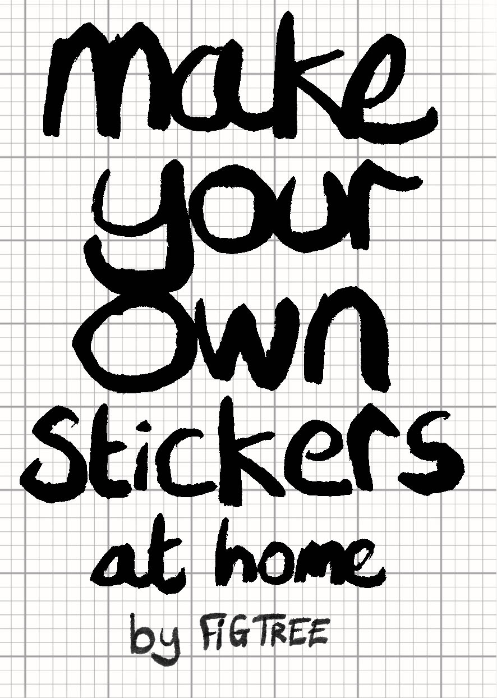
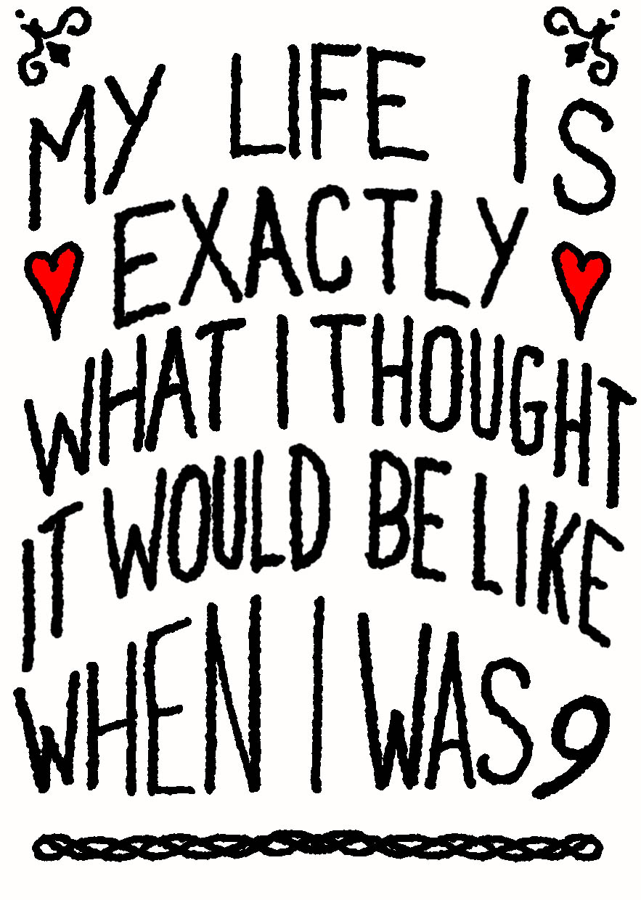

# Zines

## queer.ink

the queer.ink zine series represents my own exploration of gender, sexuality, identity, and societal expectations.

It acts as a document of my journey of self-discovery as well as a tool to share my experiences with others who may be in similar situations.

### №1 [Genders Gonna Gend](zines/queerink_001.pdf)

In my first zine, I talk about the challenges I faced dealing with hormones, depression, and anxiety while figuring out my true self. I share personal stories about the emotional journey of understanding my gender identity and true self. My story underscores how crucial representation and support are in the path to self-acceptance and being true to oneself. This zine is about resilience, love, and the pursuit of a more inclusive and accepting world.

### №2 [Panic at the Tesco](zines/queerink_002.pdf)

In this zine, I share my personal journey through mental health challenges and self-discovery. I talk about living with autism, dealing with anxiety, and finding comfort in creative expression. I open up about my experiences and coping strategies, like using noise-canceling headphones and fidget toys to make everyday life easier as a neurodivergent person. This issue of queer.ink offers a look into my world, showcasing resilience, self-acceptance, and the importance of embracing our unique selves while navigating mental health.

### №3 [There Were no Signs](zines/queerink_003.pdf)

When I started to think if I was trans it felt like it came out of nowhere. I had no frame of reference for what a trans person was or what their experiences might be like. But in the years since I came out I’ll get occasional flashbacks to little snippets of my past that should really have been a wakeup call at the time.

I was never really a fan of traditionally masculine things growing up, but I had even less interest in girly things either. I just thought it was silly to separate children based on something as superficial as gender. This ambivalence did let me explore parts of the gender spectrum, from hair and nail polish, to growing a beard and wearing a suit.

If I’d only known that living as my true self was a possibility, any of these signs could have tipped the balance and helped me transition earlier.

## Mini Zines

### [Make Your Own Stickers at Home](zines/make_your_own_stickers_at_home.pdf)

{: style="max-width:300px"}

### [Life is Exactly How I Thought it Would be When I Was 9](zines/my_life_is_exactly_what_I_thought_it_would_be_like_when_I_was_nine.pdf)

{: style="max-width:300px"}
